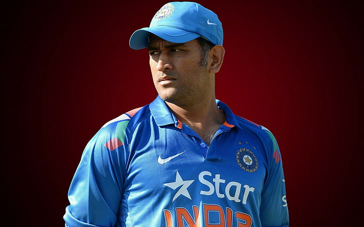

# big-data-dev
# Sumanth

## Current:

I am a student in the final semester of my Applied Computer Science program. This semester includes one more course called Graduate Directed Project 02 and successful completion of both the courses will wrap up my degree.

## Background:

* I am from Nellore, A.P, INDIA. 
* I completed my undergraduate in Computer Science and Engineering at Priyadharshini College of Engineering and Technology with an aggregate of 72%. 
* I've got no industrial experience since after completion of my undergrad I choose to study for a Master's in Applied Computer Science to gain more knowledge and help me grow as a developer. 
* My hobbies are browsing the internet, playing cricket and listening to music.

## Plans:

* I am eagerly waiting to work as a full-stack developer in an esteemed industry where I can showcase my skills and also learn a lot more new technologies that can help me to build a solid profile.

* I can say one thing interesting about me is I am good at learning new things very quickly.

## Links
You also can reach me out at:

LinkedIn: https://www.linkedin.com/in/sumanth-reddy-76a88719a/

GitHub: https://github.com/sumanthreddy1233

He is M.S. Dhoni, the Captain of Indian Cricket team and I aspire to be like him.
